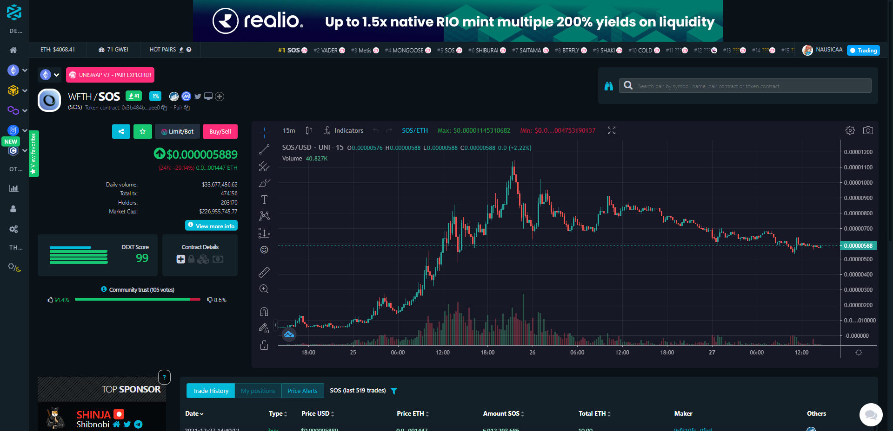
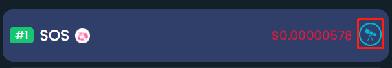
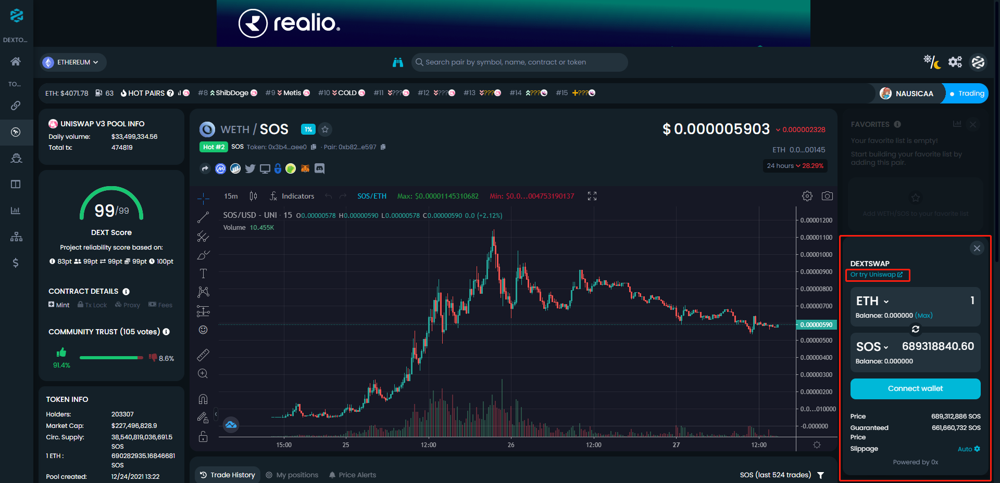

# 如何冲土狗-与土狗恋爱注意事项

# 记住一些网址

[https://dextools.io/](https://dextools.io/)

# 热度

> 冲土狗就是要有热度，交易量大的

## 在 https://dextools.io/ 中点击Launch App

## 这个页面就能看到各个公链当前热度、交易量的排行，比如在以太链中最近热度最高的、交易量最大的SOS（当前2021年12月27日）

# 会止盈止损

涨了之后建议是先出本金，一个利好出一点，跌了不至于难受，暴涨不至于拍断腿。

冲土狗失败率很高，不要留念，冲错了立刻止损斩仓。

# 绝不留念

不管多厉害的土狗，错过了就错过了，不要是去追高。

# 勤奋

除了在dextools中获取热门土狗，还需要每天关注推特、各种社区，主动出击。

# 如何购买

1. 从交易所提现ETH（以太链）或者BNB（币安链）或者其他链到你的钱包，主要是看土狗在哪个公链上。

2. 在钱包的浏览器中访问：https://dextools.io/

3. 选择你要冲的土狗，就在dextools中购买或者点击 Or try XXXXXX

