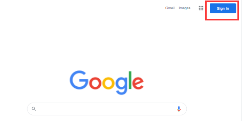
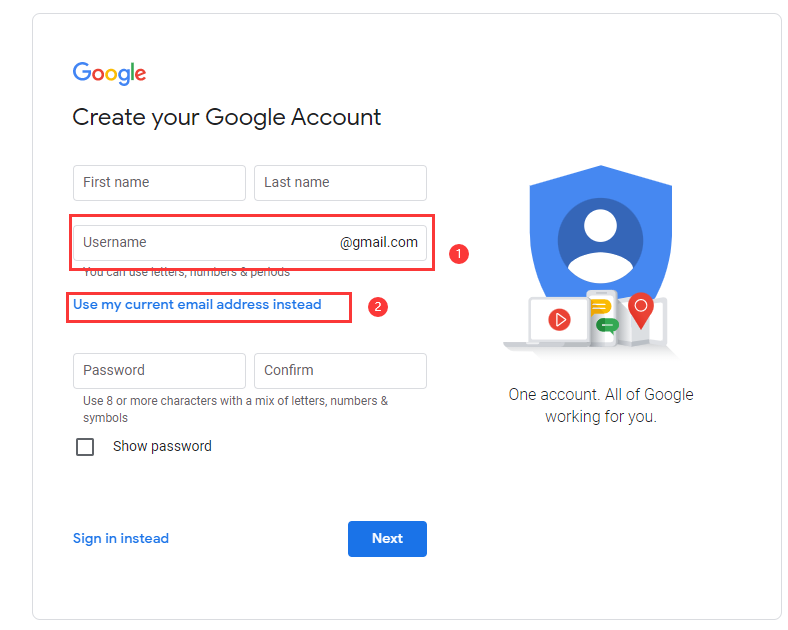
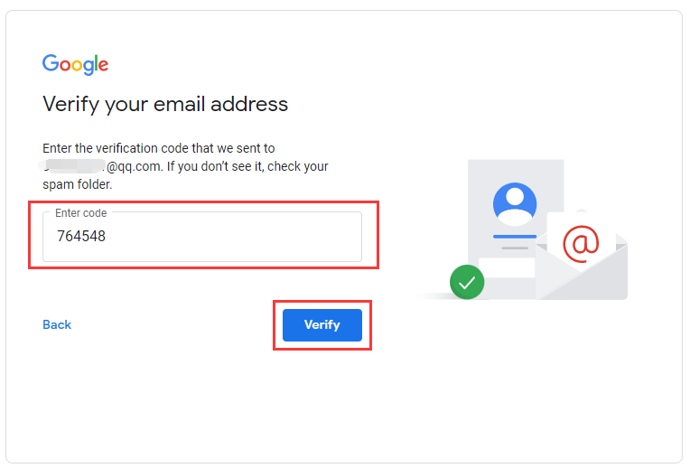
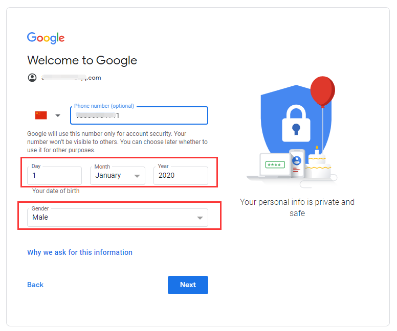

# 电脑端注册（需翻墙）

## 在电脑上打开google谷歌官方网站，点击左上角的【sign in】

[谷歌邮箱官网](https://mail.google.com/)

## 打开google sign in 后注册账号请点击【Crrate account】创建账号

## 注册你的谷歌账号，首先填写自己的姓名

## 可以直接输入一个新的邮箱注册gmail邮箱或者点击【use my current email address instead】使用自己的QQ邮箱或网易邮箱

## 最后输入2次确认登录密码字母+数字，不少于8位

## 注册信息填写完成后，请点击【Next】下一步继续

## 请输入邮箱接到的验证码，并点击【Verify】完成认证

## 完成邮箱验证后，继续完成手机号码验证，请输入有效的手机号码，并点击【Next】

## 输入手机验证码，点击Verify完成手机验证

## 手机号码验证通过后，选择出生年月日及性别，然后点击【Next】

## 完成手机验证，并填写生日性别后，提示让开启你可以选择跳过或同意开启

## 接着，注册成功请同意协议点击底部的【i agree】

## 同意协议后，注册成功，可正常使用谷歌帐号登录，并使用邮箱或手机验证验证

