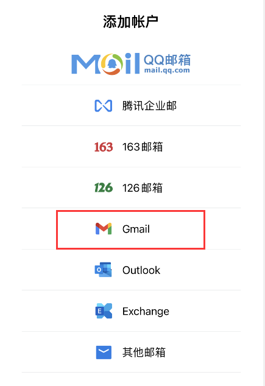
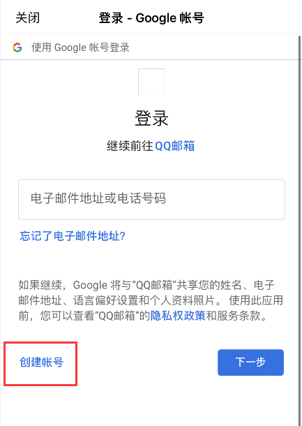
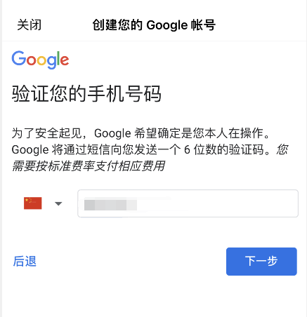
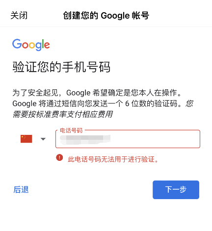
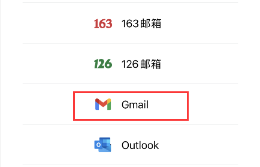
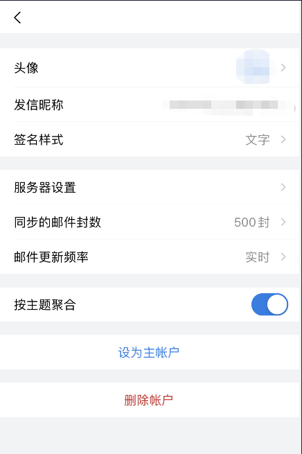

# 手机端注册（推荐）（无需翻墙）

## 下载QQ邮箱APP

在手机的应用商店下载即可

## 选择谷歌的Gmail邮箱帐户

## 进入google帐号选择创建帐号

## 创建您的Google帐号，输入谷歌gmail帐号注册信息

## 输入一个有效的国内手机号码，并下一步完成手机号码验证

## 大部分在注册谷歌帐号或gmail邮箱帐号验证您的手机号码时遇到了无法验证的情况例如：此电话号码无法用于进行验证

> 可以翻墙切换节点试试

## 验证您的手机号码通过后，谷歌帐号或gmail邮箱帐号注册成功，请再次回到QQ邮箱添加账户

## 添加Gmail成功，即可正常在QQ邮箱里使用谷歌gmail邮箱帐号

