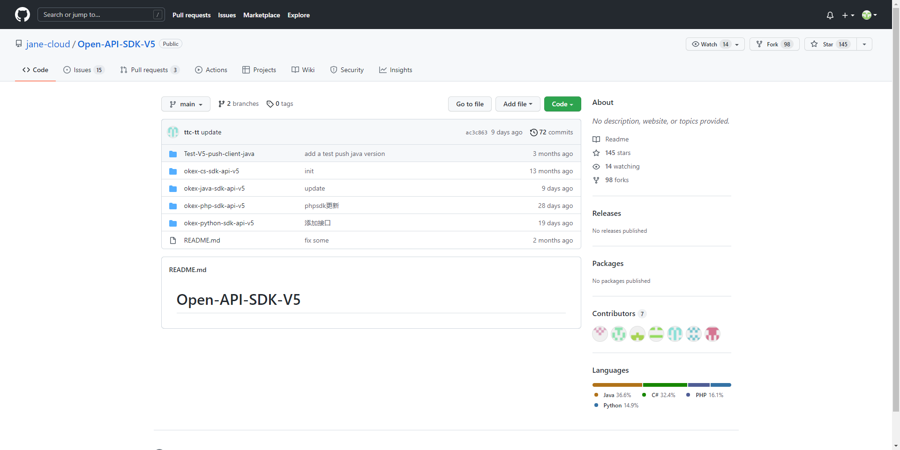
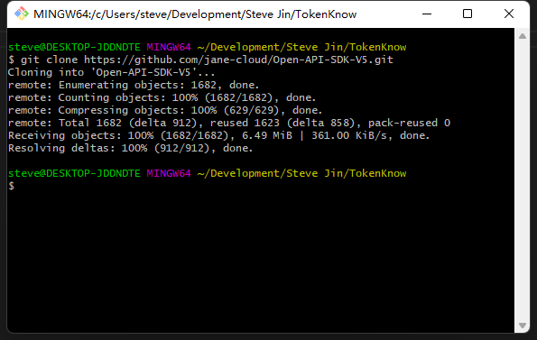
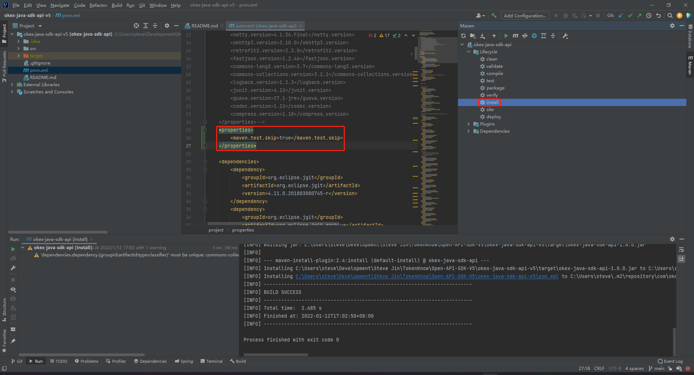

# 获取OKEx Api SDK

欧易官方提供了C#、Java、PHP、Python的SDK。

SDK地址：[https://github.com/jane-cloud/Open-API-SDK-V5](https://github.com/jane-cloud/Open-API-SDK-V5)



# 拉取Java的SDK，安装到maven

## 通过Git拉取SDK



## 通过Idea打开Java的SDK

## 在pom文件中加入配置

```java
<properties>
    <maven.test.skip>true</maven.test.skip>
</properties>
```

## 编译安装到Maven



## 创建Java的Maven工程并引入安装的SDK

