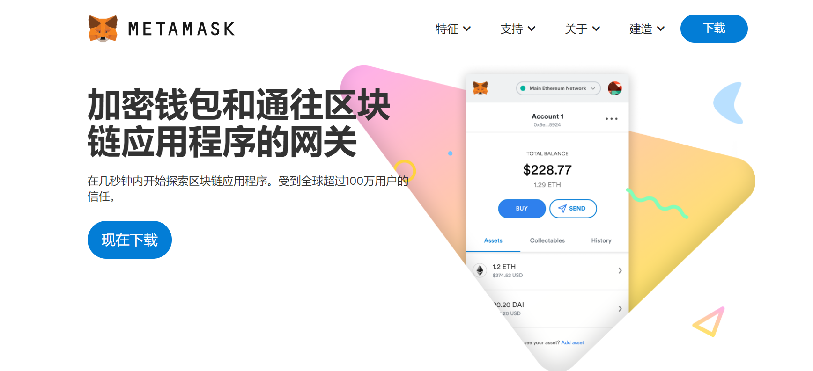

# 创建钱包

> 特别说明：本文只介绍MetaMask钱包的使用，不作为广告，可使用TP钱包、币安钱包、Imtoken钱包等其他钱包。

我们将以Google Chrome为例演示如何安装MetaMask。之所以选择Chrome是因为对比其他浏览器，Chrome的使用更广泛。但如果你使用的是Firefox 或 Opera，步骤也基本一样。

# 什么是Metamask？

MetaMask是支持Chrome, Firefox和Opera的浏览器扩展，也有安卓、苹果的APP。使用MetaMask可在浏览器里创建自己专有的以太坊钱包，从而使用MetaMask轻松转账。

# 访问[MetaMask](https://metamask.io/)

点击Download（下载）， 点击chrome（谷歌），然后安装插件到谷歌（MetaMask已经支持下载手机端app，看大家喜好自行选择）。

成功安装插件之后，我们可以从扩展程序中查看，如下图：

# 注册MetaMask钱包

依次如下：创建钱包——I Agree——创建密码——备份助记词

助记词一定要妥善保存（建议手写两份保存，不建议直接复制粘贴在任何联网设备上），如果丢失，你这个钱包就丢失，你的币也找不回来了。MetaMask是去中心化钱包，助记词一旦丢失没有人可以找回。

# 注册MetaMask钱包

你的以太坊钱包地址，点一下就可以复制。

如果想看完整的地址，点右边的“...”，再点“账户详情”查看即可。

