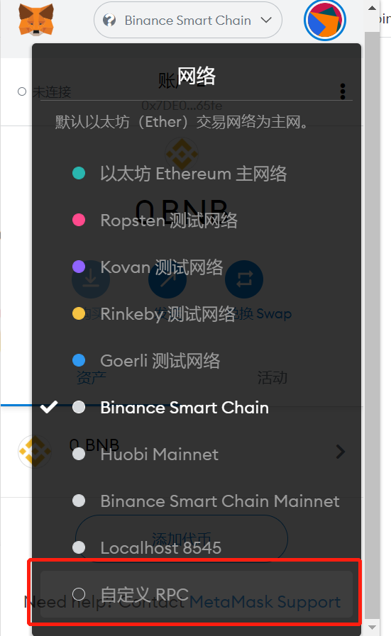
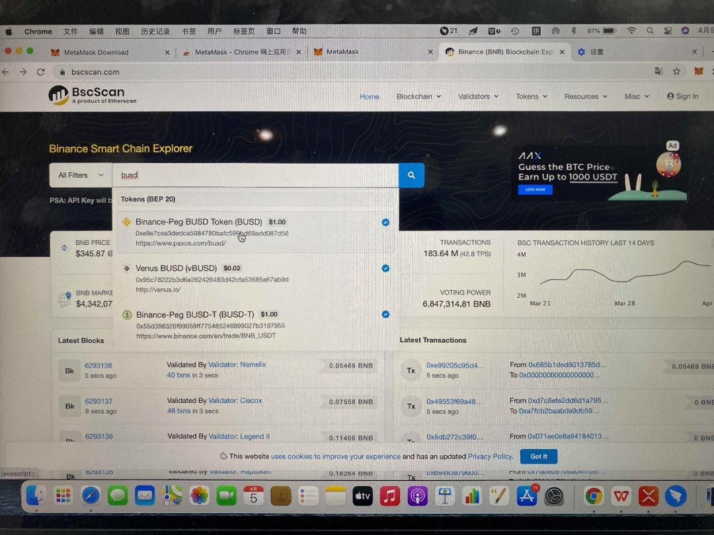
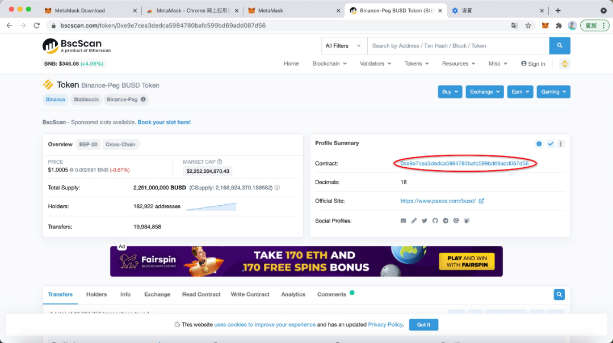
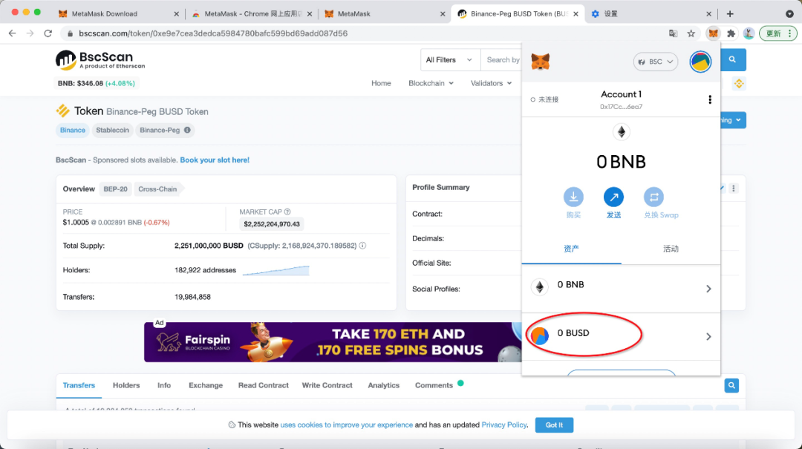
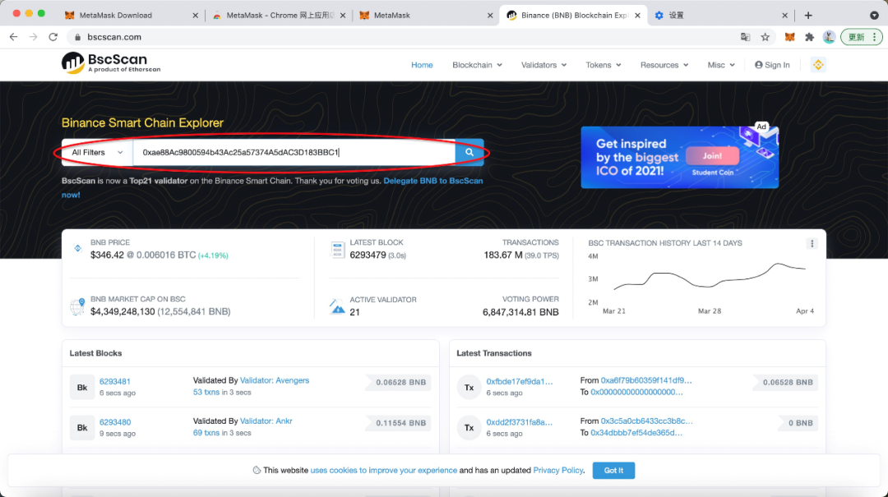
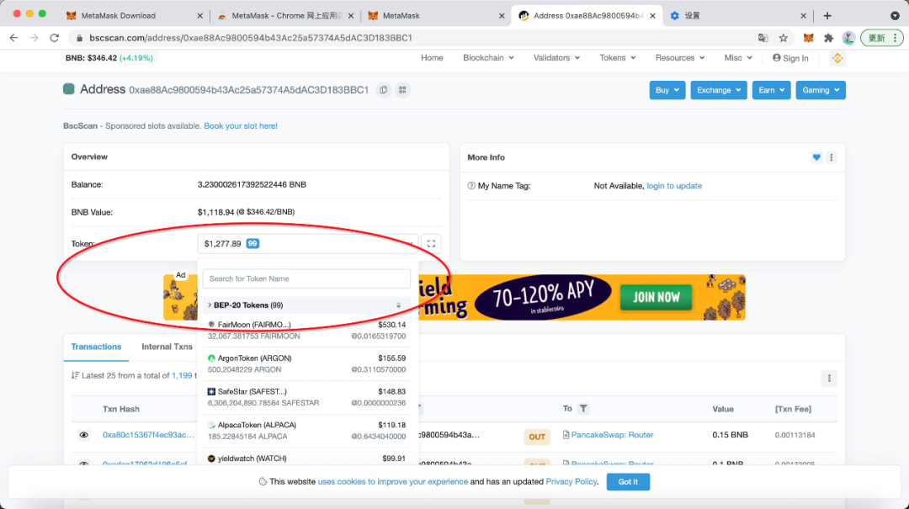
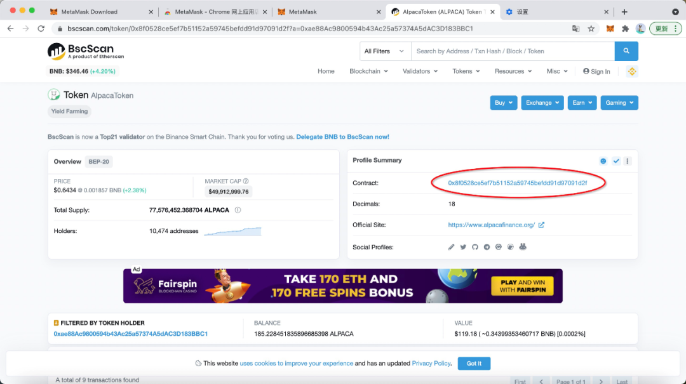

# 钱包的使用和区块链浏览器的使用

# 添加币安智能链（BSC）和火币生态链(HECO)

点击钱包右上角的“以太坊网络”，拉到最后，点击“自定义RPC”，添加币安和火币的网络。

## 添加火币生态链，填写下面信息：

网络名称：Huobi Mainnet

新增RPC URL：https://http-mainnet.hecochain.com

ChainID: 128

符号：HT

屏蔽管理器URL：https://scan.hecochain.com

## 添加币安智能链，填写下面信息：

网络名称: Binance Smart Chain

新建 RPC URL：https://bsc-dataseed1.binance.org

连锁ID：56

符号：BNB

# 从交易所向链上地址转账

无论是在ETH、BSC还是Heco上，发生的交易都会被记录在区块链中，所以任何一次操作都必须支付一定的Gas Fee。

不同的主网使用的代币不同，ETH主网上使用ETH，BSC上使用BNB，Heco上使用HT。

所以，在进行操作之前，必须保证账户地址中有足够的代币用来支付矿工费。

以BSC为例，从币安中提现BNB至MetaMask的账户地址。在MetaMask中点击标红区域可以复制账户地址，再在Binance中提现BNB至该地址。

注意：此步骤需要选择BSC主网。

# 区块链浏览器的使用

## 查询代币合约地址

以“BUSD”为例，在搜索框中输入“BUSD”，并在下拉菜单中选择该代币。

标红区域即为BUSD的代币合约地址，复制该地址，并添加到MetaMask中，便可以实时查看MetaMask账户中该代币的余额。

点击“添加代币”和“自定义代币”，并将复制的合约地址输入“代币合约地址”一栏，再点击“下一步”和“添加代币”即可完成添加。

## 查询账户持有资产

除了查询代币合约地址以外，区块链浏览器还能查询任意地址所持有的代币。所以可以利用这个方法，查询我们账户中持有的其他资产。

如图所示，在搜索框中输入想要查询的账户地址，点击搜索。

点击“Token”一栏，在下拉菜单中，可以看到该地址所持有的所有代币。

在下拉菜单中点击想要查询的代币，即可进入该代币的主页，获得对应的代币合约地址。同样的，复制标红区域，重复上述“添加代币”操作，可以将该代币添加到MetaMask中。

## 查询账户历史交易

除了能够查询任意地址持有的代币外，区块链浏览器还可以提供该地址的历史交易信息，方便用户对账或者追随“巨鲸”的交易行为。

如图所示，在“Transaction”一栏下，可以看到该地址的所有交易信息，点击对应交易哈希，即可查看交易详情。

