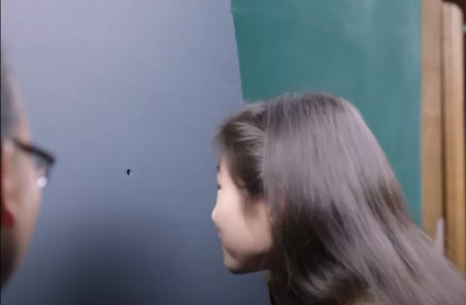
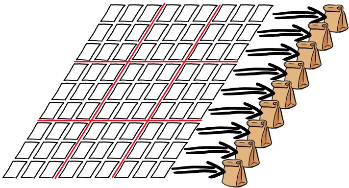

# 神奇的零知识证明，既能保守秘密，又能让别人信你！

某人声称他解决了哥德巴赫猜想，但是怕别人抄袭，不能暴露细节，怎么在不公布细节的情况下让大家相信他确实证明了哥德巴赫猜想？

看起来似乎不可能，但是确实有一种方法，叫做“零知识证明”，来解决信任的问题。

零知识证明的定义是：证明者（prover）能够在不向验证者（verifier）提供任何有用的信息的情况下，使验证者（verifier）相信某个论断是正确的。

定义干巴巴的，太无趣了，举两个例子来消化一下（例子的来源参见文末链接）。

## 企鹅

假如你手里有这么一幅图，里边是成百上千只企鹅：

但是，其中藏着一只和企鹅有点儿像的海鹦鹉：

你知道这个海鹦鹉藏在别的地方，但是你不想告诉别人具体的位置。

那么问题来了：你如何在不透漏具体位置的情况下，向别人证明你的确知道海鹦鹉的位置呢？

一个非常简单的办法是，你拿一个板子，上面留个孔，把图片放到板子后面，并且让海鹦鹉对准那个孔。

这样当别人通过洞往里边看的时候，他就会看到海鹦鹉。

但重点是：你没有泄露海鹦鹉的位置，别人就知道图片中确实有一只海鹦鹉。

这就是零知识证明。

## 数独

上面的例子有点简单，再来看个复杂一点儿的数独游戏。

数独规则非常简单，玩家需要根据9×9盘面上已知的提示数字，推理出所有剩余空格的数字，并满足每一行、每一列、每一个粗线宫（3*3）内的数字均含1~9，不重复。

假设大胖和小痩都喜欢玩数独游戏，他们经常互相出数独难题考对方。

有一天，大胖给小痩出了一个数独难题，小痩怎么都做不出来，于是他找到了大胖。

小痩：胖哥，你是不是作弊了，出了一道无解的数独？

大胖：哈哈，是你的水平不行吧，这个数独是有解决方案的。

小痩：我不信，你把答案告诉我。

大胖：我不告诉你答案，但是我会用零知识证明我确实知道答案。

大胖怎么用零知识证明呢？

他让小痩转过身去，然后做了九九八十一张卡片，卡片上写上1~9，按照正确答案的方式摆到了桌子上。

对于那些提示数字，他把卡片数字朝上，对于需要填数的地方，他把卡片数字朝下，让小痩看不到正确答案。

小痩转过身来，他失望地发现，大胖并没有给他答案。

大胖：答案就在桌子上，你可以检查一下是不是正确，可以以行的方式、以列的方式，或者以3*3方块的方式。

小痩选择用行的方式。

大胖把每一行的卡片都装到了一个不透明的袋子中，摇了摇，确保完全混合，然后交给小痩。

小痩打开了每个袋子进行检查，果然，每个袋子中的卡片都是1~9 ，完全符合数独的规定。

小痩：这能证明啥？我也可以把1~9放入这些行，也会出现这种结果。

大胖：可是，我不会读心术，事先并不知道你要选择以行的方式来验证啊？

小痩要求重新测试，这次他选择了列验证，依然是正确的。

用3*3方格验证，依然挑不出毛病。

小痩心想：难道这小子运气极好，每次都能猜对我的验证方式，从而摆上合适的数字？这不可能！那大胖确实有非常大概率（这点很重要）知道正确答案！

在验证的过程中，小痩没有获得关于答案的任何知识，大胖成功地实施了零知识证明。

## 总结

零知识证明还有很多例子，如阿里巴巴和四十大盗、地图涂色验证、色盲游戏等等，感兴趣的可以到网上搜一下。

零知识证明是由S.Goldwasser、S.Micali及C.Rackoff在20世纪80年代初提出的，距今有30多年了，具体有什么用处呢？我们可以畅想一下：

我想贷款，银行要求月收入5000以上，但我不想透露我的工资具体是多少，这时候零知识证明就排上用场。

为了核控制、防核扩散以及核裁军，国际检查机构需要一种方法，既能确认某个国家提交的核武器信息的真实性，又不用暴露核设施的敏感信息，正好是零知识证明的用武之地。

在安全领域和区块链中，零知识证明已经有了应用：

比我（TokenKnow）有一个公钥和私钥，你安全地拿到了我的公钥，但是从来没见过我，有一天我们两个见面了。

我说：我就是TokenKnow

你可能不相信，万一有人冒充呢？

我可以生成一个随机的字符串，用我的私钥加密，然后发给你。

你用公钥解密，如果得到的字符串相同，你就知道我肯定是TokenKnow了。

比特币上每一笔交易都是透明的，谁给谁转了多少钱都是公开可查的。但是，通过零知识证明技术实现的隐私币，例如 Zcash 就可以达成隐藏交易信息，但是同时能让全网验证交易合法性的效果。

总之，零知识证明第一次把证明的正确性和证明的知识解耦开来，这种思想范式的转变是一个巨大的创新，拓展了人类的智力边界。

参考资料：

1. Computer Scientist Explains One Concept in 5 Levels of Difficulty

https://www.youtube.com/watch?v=fOGdb1CTu5c

里边讲述了企鹅图片的例子。更有趣的是他分别对小学生、中学生、大学生、研究生、专家等五个级别的人讲述零知识证明，非常有趣，强烈推荐。

2. The Incredible Machine

https://medium.com/qed-it/the-incredible-machine-4d1270d7363a

其中不但讲述了数独的例子，还构造了一个证明的机器，感兴趣的可以深入了解一下。